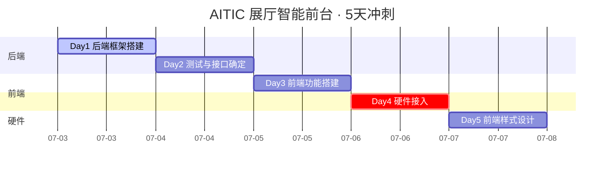

# AITIC 展厅智能前台 · 完整实现计划

> 版本：V1　日期：2026-07-03　状态：可执行，建议随每日进展打勾更新
> 整合自：《访客欢迎系统 Brief V1》《技术方案 V1》《前台系统 完成方案》
> 作者：谭天成（本文档为工程执行层，供个人开发对照使用）

## 0. 这份文档是什么

完成方案是给领导看的"承诺"——5个节点、5个验收标准；技术方案是"骨架"——四层架构、技术选型。这两份之间还缺一层：**每天具体写什么代码、表结构长什么样、接口怎么定、Mock怎么切成真实硬件**。这份文档就是补这一层，目标是让你打开电脑就能开始写，不用再停下来想"这个字段该叫什么""这个事件该怎么设计"。

标记约定：
- 🔴 P0：今天必须完成，否则后面会卡住
- 🟡 P1：尽量做，时间不够可以往后挪
- 💬 建议默认值：技术方案/Brief里标"待明确"的地方，这里给一个可以直接用的默认答案，评审时可以推翻

---

## 一、总览：5天节奏

今天(7.3)是周五，这意味着 Day2/Day3 落在周末，Day4(硬件接入)落在周一——如果Windows测试机、NFC读写器这些硬件还没到位，**周末大概率联系不上供应商/行政**，所以硬件到位情况必须**今天**问清楚，别等周一早上才发现设备没影。这个时间结构本身就是本计划新增的一条风险，后面第二、六节会再展开。



| Day | 日期 | 星期 | 目标（原文照抄完成方案） | 验收方法（原文照抄完成方案） |
|---|---|---|---|---|
| 1 | 7.3 | 周五（今天） | 数据底座 + 主流程代码骨架 | 各模块代码初步搭建完成，有一个耦合了所有模块的启动入口 |
| 2 | 7.4 | 周六 | 模块化测试；使用假数据端到端测试；完成API接口文档 | 能实现所有后端功能（假数据）；所有API接口确定且文档齐全 |
| 3 | 7.5 | 周日 | 前端功能搭建，不做样式，完成前后端联调 | 能在浏览器中实现所有预期功能（硬件仍用假数据） |
| 4 | 7.6 | 周一 | 后端代码适配NFC刷卡验卡设备 | 能实现刷卡验卡端到端全功能 |
| 5 | 7.7 | 周二 | 完成基础前端样式设计 | 能在浏览器中看到完善的交互界面 |

---

## 二、今天必须锁定的决策（Day 0 决策清单）

技术方案和Brief里一共留了8个"待明确"的口子。5天冲刺不能带着开放问题往前走，下面每条给一个可以直接采用的默认值——不满意随时可以改，但**先用这个往下走，不要空着**。

| # | 问题 | 来源 | 💬 建议默认值  （✅表示采用默认值） |
|---|---|---|---|
| 1 | 日期自查机制的自然月边界 | 两份文档都提到"待定义" | ✅ 自然月按**来访日期**（不是导入/登记时间）归属；一个来访记录只属于它自己来访日期所在的月，不做跨月拆分 |
| 2 | "场次"怎么定义 | Brief 步骤2 | ✅ 场次 = (来访日期, 计划场次时间) 的唯一组合；汇总总表按这个组合分组展示 |
| 3 | 欢迎词模板与6类身份的对应关系 | Brief模板表只有5行，和visits的6类身份对不齐 | ✅ `welcome_templates` 直接采用与 `visits` 相同的6类身份枚举（企业领导、企业员工分开建两行，初始文案先给一样的），另加1条"默认"兜底行——不做多对一映射，保持"可配置表"最简单直接，以后要分化直接改文案即可 |
| 4 | 多LED屏幕分流规则 | 两份文档都提到"待明确" | ✅ MVP阶段所有屏幕**同步显示同一批次访客信息**，不分组；接口预留 `screen_ids` 参数，以后要分组显示只是加个路由逻辑，不影响现在的开发 |
| 5 | 操作员账号/权限体系 | 技术方案风险#5 | ✅ 5天冲刺内**不做**登录/多用户/权限，单一本地管理员操作，符合"值班人员用同一台电脑"的实际场景；不影响任何一天的验收标准  **<u>我对评价：五天内绝对绝对绝对不做用户鉴权！！！</u>** |
| 6 | SQLite备份策略 | 技术方案风险#6 | ✅ 用 APScheduler 做每日定时把 `.db` 文件复制到 `backup/` 目录（按日期命名），Day1顺手加，成本很低不要拖到最后 |
| 7 | 重复刷卡是否允许多次通过 | 两份文档都没提，但真实场景会遇到 | ✅ MVP不做防重放/防重入校验，只要"日期+姓名"对得上就算通过，**<u>不记录"已入场"状态</u>**——除非领导明确要求，不要在5天里加这个复杂度 |
| 8 | 🔴 NFC硬件型号 + Windows测试机到位时间 | Brief风险#1，完成方案也标为最大风险 | **今天必须问清楚**：(a) NFC读写器具体型号，是否是PC/SC兼容设备（常见如ACR122U这类可以直接用 `pyscard`）；(b) Windows测试机什么时候能拿到手。这两项决定Day4能不能做，而周六周日基本联系不上人 |
| 9 | 🟡 onbon LED SDK 对应哪个型号 | 我查了一下官网 | 见下方专门说明 |

**关于第9条，onbon SDK的情况**：我看了一下 Brief 里给的下载链接，那是 LedShow Suite 这个上位机控制**软件**（GUI程序），不是给开发者调的接口。真正要用的是官网"二次开发包"分类下的SDK：https://www.onbonbx.com/download/SDK ，但这个SDK**不是一个统一SDK**，而是按硬件型号分开的——多媒体播放器(Y/C系列)、六代图文控制器(BX6)、五代双基色控制器(BX5)、LCD商显主板，各自独立一套开发包。也就是说光看这个页面还不够，**必须先确认展厅LED屏幕/发送卡具体是哪个型号**才能下对应的包，不能笼统地"研究一下SDK"。如果拿到手册还是看不懂协议，官网上有专门的"二次开发"技术支持邮箱 `dev@onbonbx.com`，可以直接发邮件问。建议今天顺手把型号问清楚，这样Day4开局就不用再卡在"不知道下哪个包"上。

---

## 三、项目结构

在 react-fastapi-stack 的常用骨架基础上做了调整：**去掉了Docker/PostgreSQL/Nginx**，因为这个项目的部署目标是单机Windows PC（技术方案3.5已经定了：打包成Windows服务(NSSM)或常驻脚本+看门狗），跟容器化部署是两回事；其余目录命名习惯（`app/api`、`app/core`、`app/models`、`app/schemas`，前端 `src/api`、`src/pages`、`src/hooks`）沿用你平时的习惯。

```text
aitic-reception/
├── backend/
│   ├── app/
│   │   ├── main.py              # 统一入口：组装DB+事件总线+所有Service+Adapter+Watcher，一次性启动
│   │   ├── core/
│   │   │   ├── config.py        # pydantic-settings，读取 .env（AI Key、监听路径、硬件地址等）
│   │   │   ├── event_bus.py     # asyncio.Queue封装的最简pub/sub
│   │   │   ├── db.py            # SQLAlchemy engine/session（sqlite:///./data/app.db）
│   │   │   └── logging.py
│   │   ├── models/              # SQLAlchemy ORM，对应四.1六张表
│   │   ├── schemas/             # Pydantic请求/响应模型
│   │   ├── services/            # 业务服务层：登记/AI文案/写卡/校验/日志
│   │   │   ├── registration_service.py
│   │   │   ├── ai_writeup_service.py
│   │   │   ├── card_service.py
│   │   │   ├── verify_service.py
│   │   │   └── log_service.py
│   │   ├── adapters/            # 适配器层，每类都是 base(抽象) + mock + real
│   │   │   ├── base.py
│   │   │   ├── nfc/{mock.py, real.py}
│   │   │   ├── led/{mock.py, real.py}
│   │   │   ├── tts/{mock.py, real.py}
│   │   │   └── ai/{mock.py, real.py}
│   │   ├── api/                 # FastAPI路由（对应四.4端点清单）
│   │   │   ├── visits.py
│   │   │   ├── imports.py
│   │   │   ├── templates.py
│   │   │   ├── cards.py
│   │   │   ├── logs.py
│   │   │   ├── settings.py
│   │   │   ├── debug.py         # 仅Mock模式可用，模拟刷卡等测试端点
│   │   │   └── ws.py            # WebSocket
│   │   └── watchers/
│   │       └── excel_watcher.py # watchdog监听新增Excel
│   ├── tests/
│   ├── fixtures/
│   │   └── sample_visitors.xlsx # Day2准备，覆盖6类身份+1条脏数据
│   ├── data/app.db              # 运行时生成，gitignore
│   ├── backup/                  # 每日DB备份，gitignore
│   ├── requirements.txt
│   └── .env.example
├── frontend/
│   ├── src/
│   │   ├── pages/                # 8大页面
│   │   ├── components/
│   │   ├── hooks/
│   │   ├── api/
│   │   │   ├── client.ts         # axios实例
│   │   │   ├── queryKeys.ts      # React Query key集中管理
│   │   │   └── ...按资源拆分的hooks
│   │   ├── stores/
│   │   │   └── realtimeStore.ts  # Zustand，接WebSocket推送
│   │   ├── App.tsx
│   │   └── router.tsx
│   ├── package.json
│   └── vite.config.ts            # 记得配proxy，把/api转发到后端8000端口
└── docs/
    └── openapi.json              # Day2从FastAPI自动生成的文档导出一份存档
```

> 💬 数据库迁移工具：react-fastapi-stack的最佳实践是"不要在生产环境依赖`create_all`,用Alembic"。5天冲刺期间建议先用`Base.metadata.create_all()`图快，等表结构在Day1-2稳定下来、时间允许的话再补Alembic——这是有意识的取舍，不是漏掉了。

---

## 四、核心技术契约（贯穿全程，Day1就要定下来）

这一节是整个5天里最重要的部分。技术方案V1里六张表只列了字段用途没给类型，四个适配器只说了"用适配器模式"没给具体接口——这些"初步草案"如果拖到中途才细化，会导致返工。下面直接给出可以照着建库、照着写代码的版本。

### 4.1 数据表结构（细化版）

**`visits`　来访记录，唯一权威数据源**

| 字段 | 类型 | 说明 |
|---|---|---|
| id | INTEGER PK | 自增主键 |
| visit_date | DATE | 来访日期 |
| session_time | DATETIME | 计划场次时间（配合visit_date构成"场次"） |
| name | VARCHAR(64) | 姓名 |
| phone | VARCHAR(20) | 手机号 |
| nationality | VARCHAR(32) | 国籍 |
| id_number | VARCHAR(32) | 身份证号 —— 💬敏感字段，建议前端列表/日志默认脱敏显示（如显示前3后4位），别在work_log里明文打印 |
| gender | VARCHAR(8) | 性别 |
| organization | VARCHAR(128) | 单位 |
| identity_type | ENUM | 企业领导 / 企业员工 / 学校老师 / 大学生 / 中小学生 / 政府官员 |
| welcome_text | TEXT NULL | AI生成的欢迎词，未生成前为空 |
| welcome_source | ENUM NULL | ai / fallback_template |
| entry_source | ENUM | auto（自动识别）/ manual（手动上传） |
| import_batch_id | VARCHAR(36) | 本次Excel导入批次号，方便"覆盖原文档"时定位来源 |
| status | ENUM | 💬新增字段，贯穿全流程的状态机：pending → welcome_ready → card_written → verified / rejected。仪表盘和实时看板直接查这个字段就行，不用现拼各种JOIN |
| created_at / updated_at | DATETIME | — |

**`welcome_templates`　欢迎词模板**

| 字段 | 类型 | 说明 |
|---|---|---|
| id | INTEGER PK | — |
| identity_type | ENUM UNIQUE | 与visits共用同一套6类枚举，另加1条"默认"兜底（见二.3决策） |
| template_text | TEXT | 含 `{姓名}` 占位符 |
| updated_at | DATETIME | — |

**`nfc_write_log`　写卡记录**

| 字段 | 类型 | 说明 |
|---|---|---|
| id | INTEGER PK | — |
| visit_id | INTEGER FK→visits.id | — |
| card_uid | VARCHAR(64) | — |
| write_status | ENUM | success / failed / pending |
| error_message | TEXT NULL | — |
| written_at | DATETIME | — |

**`verify_log`　现场校验记录**

| 字段 | 类型 | 说明 |
|---|---|---|
| id | INTEGER PK | — |
| card_uid | VARCHAR(64) | — |
| visit_id | INTEGER FK NULL | 卡片查无对应访客时为空 |
| verify_result | ENUM | pass / fail |
| fail_reason | VARCHAR(64) NULL | name_mismatch / date_mismatch / card_not_found |
| verified_at | DATETIME | — |

**`work_log`　工作日志**

| 字段 | 类型 | 说明 |
|---|---|---|
| id | INTEGER PK | — |
| module | ENUM | registration / ai_writeup / card_write / verify / led / tts / system |
| action | VARCHAR(64) | — |
| status | ENUM | success / failure / warning |
| detail | TEXT | — |
| created_at | DATETIME | — |

**`adapter_status`　适配器健康状态**

| 字段 | 类型 | 说明 |
|---|---|---|
| adapter_name | VARCHAR PK | nfc / led / tts / ai |
| status | ENUM | online / offline / error |
| last_heartbeat | DATETIME | — |
| detail | TEXT NULL | — |

### 4.2 事件总线 Topic 设计

单机场景用 `asyncio.Queue` 自封装 pub/sub 就够（技术方案已定），下面是具体topic清单，`card.verify.*` 这条链路走单一消费者FIFO处理，天然保证语音播报不重叠（对应Brief"按NFC刷卡顺序朗读"的要求）。

| Event Topic | 触发方 | 订阅方 | 关键Payload字段 |
|---|---|---|---|
| `excel.detected` | ExcelWatcher | RegistrationService | file_path, detected_at |
| `visit.imported` | RegistrationService | AIWriteupWorker, LogService | visit_ids[], import_batch_id |
| `welcome.requested` | RegistrationService | AIWriteupWorker | visit_id |
| `welcome.generated` | AIWriteupWorker | LogService, WS推送 | visit_id, welcome_text, source |
| `card.write.requested` | CardService（前端触发/批量任务） | NFCAdapter | visit_id, card_uid(可选) |
| `card.write.completed` | NFCAdapter回调 | LogService, WS推送 | visit_id, card_uid, status |
| `card.verify.requested` | NFCAdapter（读到卡，FIFO入队） | VerifyService | card_uid, raw_payload |
| `card.verify.passed` | VerifyService | LEDAdapter, TTSAdapter, LogService, WS推送 | visit_id, card_uid |
| `card.verify.failed` | VerifyService | LEDAdapter（显示无权限）, LogService, WS推送 | card_uid, fail_reason |
| `adapter.heartbeat` | 各Adapter定时上报 | AdapterStatusService, WS推送 | adapter_name, status |
| `work_log.append` | 所有服务 | LogService | module, action, status, detail |

💬 建议每个事件payload都带一个 `trace_id`（可以直接用visit_id或card_uid），方便一条访客记录从登记到播报出问题时能顺着日志串起来查，FIFO+异步链路一长，没有trace_id会很难debug。

### 4.3 适配器抽象接口（Mock优先开发的关键）

这是整个计划里优先级最高的一段代码——**Day1把接口定死，Day1-3全程对着Mock开发，Day4只是把Real实现塞进去，业务代码一行不改**。这也是你自己在完成方案里点出的最大风险（硬件适配、没有Windows机器实测）的直接应对方式：接口层面的正确性今天就能验证，不用等实物。

```python
# adapters/base.py

class AdapterHealth(BaseModel):
    status: Literal["online", "offline", "error"]
    detail: str | None = None
    last_heartbeat: datetime

class NFCAdapter(ABC):
    @abstractmethod
    async def write_card(self, card_uid: str, payload: dict) -> WriteResult: ...

    @abstractmethod
    def read_stream(self) -> AsyncIterator[CardReadEvent]:
        """持续产出刷卡事件；多个读写器的轮询、去重都在实现内部处理，
        对上层来说就是一个源源不断的事件流"""

    @abstractmethod
    async def health_check(self) -> AdapterHealth: ...

class LEDAdapter(ABC):
    @abstractmethod
    async def display(self, screen_ids: list[str], content: LEDContent) -> None: ...

    @abstractmethod
    async def show_rejected(self, screen_ids: list[str]) -> None: ...

    @abstractmethod
    async def health_check(self) -> AdapterHealth: ...

class TTSAdapter(ABC):
    @abstractmethod
    async def enqueue_speech(self, text: str) -> None:
        """加入播报队列，内部保证FIFO顺序播放，调用方不用关心排队逻辑"""

    @abstractmethod
    async def health_check(self) -> AdapterHealth: ...

class AIAdapter(ABC):
    @abstractmethod
    async def generate_welcome(self, visit: VisitInfo) -> str:
        """失败时抛异常，由AIWriteupWorker捕获后走规则模板兜底
        （技术方案3.2已经定了这个降级策略）"""
```

Mock实现要点：`MockNFCAdapter.read_stream()` 不需要真的等硬件，配合下面 `POST /debug/simulate-card-read` 端点，让前端/测试脚本可以随时"模拟刷一次卡"，这是Day2-3端到端测试和前端联调能不依赖硬件的关键。

### 4.4 REST API 端点清单

| 方法 | 路径 | 说明 |
|---|---|---|
| POST | `/api/import/preview` | 上传Excel预解析（两阶段提交第一步） |
| POST | `/api/import/commit` | 确认入库 |
| GET | `/api/visits` | 列表，支持按日期/场次/身份筛选、分页 |
| GET | `/api/visits/{id}` | 详情 |
| PATCH | `/api/visits/{id}` | 手动修正 |
| GET | `/api/visits/summary` | 汇总总表，`?month=2026-07` 按场次(来访日期+场次时间)分组 |
| GET | `/api/visits/summary/export` | 导出Excel |
| GET | `/api/visits/today` | 当日来访名单 |
| GET | `/api/templates` | 欢迎词模板列表（7条：6类身份+默认） |
| PUT | `/api/templates/{identity_type}` | 更新模板文案 |
| POST | `/api/cards/write` | 触发单张/批量写卡 |
| GET | `/api/cards/write-log` | 写卡记录 |
| GET | `/api/verify-log` | 校验记录 |
| GET | `/api/work-logs` | 工作日志，支持按模块/时间/状态筛选 |
| GET | `/api/adapters/status` | 4个适配器在线状态 |
| GET/PUT | `/api/settings` | 系统设置：硬件地址、AI Key、监听路径 |
| POST | `/api/debug/simulate-card-read` | 🟡仅Mock模式暴露，模拟一次刷卡，供联调测试用 |
| WS | `/ws/realtime` | 推送刷卡事件、校验结果、适配器心跳、告警 |

FastAPI自带 `/docs` 就是Swagger文档，Day2结束时把 `openapi.json` 导出存进 `docs/` 目录留痕即可，不用额外手写一份。

### 4.5 WebSocket 消息格式

```json
{
  "type": "card.verify.passed",
  "timestamp": "2026-07-06T10:23:00+08:00",
  "payload": { "visit_id": 123, "card_uid": "04A3B2C1" }
}
```

`type` 直接复用 4.2 里的事件topic名，前端Zustand store按`type`分发到对应UI更新逻辑即可。

---

## 五、逐日任务分解

### Day 1 · 7.3（周五，今天）—— 后端基本框架

> 完成方案原定目标："数据底座 + 主流程代码骨架，有一个耦合了所有模块的启动入口"

**上午（🔴 P0 · 打骨架）**
- [ ] 初始化仓库（backend/frontend双目录），Python虚拟环境，装依赖：`fastapi` `uvicorn[standard]` `sqlalchemy` `pydantic-settings` `watchdog` `pandas` `openpyxl` `python-multipart` `websockets` `httpx` `apscheduler`
- [ ] `core/event_bus.py`：asyncio.Queue实现的最简pub/sub，支持同一topic多订阅者
- [ ] 6张表的SQLAlchemy模型（照抄四.1），`create_all` 建库
- [ ] `adapters/base.py` 四个抽象基类 + 四个Mock实现；`MockNFCAdapter` 顺手把"模拟刷卡"的钩子留出来

**下午（🔴 P0 · 串起主链路）**
- [ ] RegistrationService：解析Excel（自动监听和手动上传共用同一个parser）→写入visits→publish `visit.imported` + `welcome.requested`
- [ ] AIWriteupWorker：订阅`welcome.requested`→调MockAIAdapter生成假欢迎词→写回DB→publish `welcome.generated`
- [ ] CardService：订阅`welcome.generated`→调MockNFCAdapter写卡→publish `card.write.completed`
- [ ] VerifyService：订阅MockNFC产出的`card.verify.requested`→比对visits表(日期+姓名)→publish `card.verify.passed/failed`
- [ ] LogService：订阅所有事件，统一写入work_log（这个做完最省心，后面全靠它排查问题）
- [ ] `main.py`统一入口：组装DB+事件总线+全部Service+Adapter+ExcelWatcher；记得开CORS，让Vite dev server(5173)能连后端(8000)

**今日验收（自测）**：往watchdog监听目录扔一个准备好的假Excel，控制台/work_log表里能看到完整走完 登记→AI(mock)→写卡(mock)→校验(mock)→日志 全流程，不报错。

**🟡 P1（有余力再做）**
- [ ] 二.6 提到的APScheduler每日DB备份，顺手加上
- [ ] 二.8 提到的NFC硬件型号/Windows测试机到位情况，今天必须问，别拖

### Day 2 · 7.4（周六）—— 后端测试与接口确定

> 完成方案原定目标："模块化测试；使用假数据端到端测试；完成API接口文档"

- [ ] 🔴 `fixtures/sample_visitors.xlsx`：覆盖6种身份类型 + 至少1条会校验失败的脏数据（姓名/日期对不上）
- [ ] 🔴 pytest单测：每个Service至少1个正向 + 1个异常路径
- [ ] 🔴 端到端测试脚本：跑一遍fixture，断言最终DB状态符合预期
- [ ] 🔴 AIAdapter接真实千问API + 失败fallback到规则模板（技术方案3.2已定的降级策略），这条链路今天必须打通，别拖到Day4跟硬件一起挤
- [ ] 🔴 按四.4写完所有路由；`/debug/simulate-card-read` 一起加上，Day3联调要用
- [ ] 🔴 WebSocket端点打通，至少能推 `card.verify.passed/failed` 和 `adapter.heartbeat`
- [ ] 🟡 导出 `openapi.json` 存进 `docs/`

**今日验收**：用Swagger UI把 上传Excel→预览→确认入库→(mock)生成欢迎词→(mock)写卡→模拟刷卡校验 全流程手动点一遍，全部成功；`/docs`能看到完整接口列表。

### Day 3 · 7.5（周日）—— 前端功能搭建

> 完成方案原定目标："不进行任何样式设计，完成前端功能搭建，同时完成前后端联调"

- [ ] 🔴 Vite+React+TS脚手架；`pnpm add @tanstack/react-query axios react-router-dom zustand`
- [ ] 🔴 API client层：`src/api/client.ts`（axios实例）+ `src/api/queryKeys.ts`（集中管理query key，避免命名冲突和失效遗漏）
- [ ] 🔴 `stores/realtimeStore.ts`：Zustand接WebSocket，处理`card.verify.*`和`adapter.heartbeat`推送
- [ ] 🔴 8个页面最小可用版本（无样式）：仪表盘 / 访客登记 / 汇总总表 / 现场实时看板 / 写卡管理 / 欢迎词模板 / 工作日志 / 系统设置
- [ ] 🔴 Excel上传两阶段提交UI：拖拽→预览表格(标红错误)→确认入库
- [ ] 🔴 用Day2加的`/debug/simulate-card-read`在现场实时看板页面手动触发几次，确认WebSocket推送到前端后UI能正确响应——这一步是硬件还没接的情况下，唯一能验证"实时看板真的实时"的方法

**今日验收**：8个页面在浏览器里全部能跑通对应功能（丑但能用），硬件仍是mock。

### Day 4 · 7.6（周一）—— 硬件接入 🔴 最高风险日

> 完成方案原定目标："后端代码适配NFC刷卡验卡设备"

- [ ] 🔴 `NFCAdapter`真实实现：如果确认是PC/SC兼容读写器（常见如ACR122U），优先试`pyscard` + `ndeflib`组合；**先打通"读卡"路径**（风险最高，越早验证越好），写卡路径可以稍后
- [ ] 🔴 `LEDAdapter`真实实现：按二.9确认的具体型号，去onbon对应分类下的二次开发包对接（不是Ledshow Suite那个GUI软件）
- [ ] 🔴 `TTSAdapter`真实实现：Windows本地离线合成，可先用 `pyttsx3`（基于系统SAPI5，前提是系统装了中文语音包）验证链路能通，音质不满意可以后续换本地模型，5天内先保证"能出声"
- [ ] 🔴 把三个Adapter从Mock切到Real：只改`main.py`里的组装逻辑，Service代码不动——这一步能不能"无痛切换"，就是检验Day1接口设计是否到位的时刻
- [ ] 🔴 真实设备端到端测试：物理刷卡→校验→LED显示+语音播报；再拿一张不在名单里的卡测拒绝路径（报错+LED"无权限入场"+蜂鸣）

**Contingency**：Mock Adapter不要删——万一今天硬件卡住没能完全跑通，至少能切回Mock模式，给领导演示完整业务流程，硬件部分标注"联调中"，比什么都演示不了要好。

**今日验收**：真实刷卡触发完整链路；拒绝路径正确触发。

### Day 5 · 7.7（周二）—— 前端样式设计

> 完成方案原定目标："完成基础的前端样式设计"

- [ ] 🔴 Tailwind样式套上8个页面，统一间距/字体/色彩（不追求惊艳，先保证整洁可用）
- [ ] 🔴 现场实时看板做"看板模式"：全屏、去侧边栏、放大字号、告警横幅（技术方案4.4已明确这条，优先级最高——这是唯一会被访客直接看到的界面）
- [ ] 🟡 硬件状态用红/绿指示灯（仪表盘+看板都要，技术方案4.4的"状态可见性优先于信息密度"原则）
- [ ] 🔴 端到端过一遍完整demo流程，准备给领导展示
- [ ] 剩余时间留作缓冲——5天冲刺压缩到这里基本没buffer了，如果前面哪天delay，这天最容易被挤

**今日验收**：完整、可展示的交互界面。

---

## 六、风险清单与工程应对

| 风险 | 来源 | 应对 |
|---|---|---|
| 🔴 NFC读写器SDK未定，且没有Windows机器实测 | Brief风险#1 / 完成方案 | 四.3的适配器接口Day1钉死，Real实现替换Mock不改业务代码；今天确认设备型号与测试机到位时间（二.8）；Day4保留Mock兜底演示方案 |
| AI云端API与"本地离线"要求，技术方案里标注"潜在矛盾" | 技术方案风险#2 | 实际不冲突：**"无需联网"只针对现场语音播报这一步**——发生在访客刷卡的瞬间；欢迎词AI生成发生在更早的登记阶段，当时PC联网调千问完全没问题；真正要离线的只有TTS引擎本身（朗读已经生成好的文字），不涉及AI生成这一步。建议在系统设置页写清楚这个"两阶段网络策略"，避免以后被展厅现场的IT网络策略卡住 |
| onbon LED SDK按型号分开，型号未定 | 我查证的信息，见二.9 | 今天确认具体型号（播放器Y/C系列 / 图文控制器BX6 / 双基色控制器BX5 / LCD商显主板），去对应分类下载；文档不清楚可联系 dev@onbonbx.com |
| 前端UI/UX质量（完成方案已自陈担忧） | 完成方案 | Day5时间本来就紧，先用简洁中性的Tailwind风格保证"整洁可用"；现场实时看板是唯一真正需要打磨的页面，其余7个后台页面functional优先 |
| SQLite单点故障 | 技术方案风险#6 | Day1顺手加每日定时备份（见二.6），成本很低，不要拖到最后 |
| 5天时间对全栈+硬件本身就很紧，任何一天delay都会往后挤 | 通用 | 每天任务已标🔴P0/🟡P1，P1可以先牺牲；Day4是关键风险日——如果前面有delay，优先保证Day4不被压缩，硬件问题需要的绝对时间最长、最不可控 |
| 周末（Day2/Day3）联系不上硬件供应商/行政 | 本文档新增观察 | 二.8的两个问题必须今天（周五）问完，不要指望周末能补救 |

---

如果Day1跑完想直接开始搭代码骨架，我可以接着把backend的目录结构和几个核心文件（event_bus、六张表的模型、四个Mock适配器）直接写出来。
