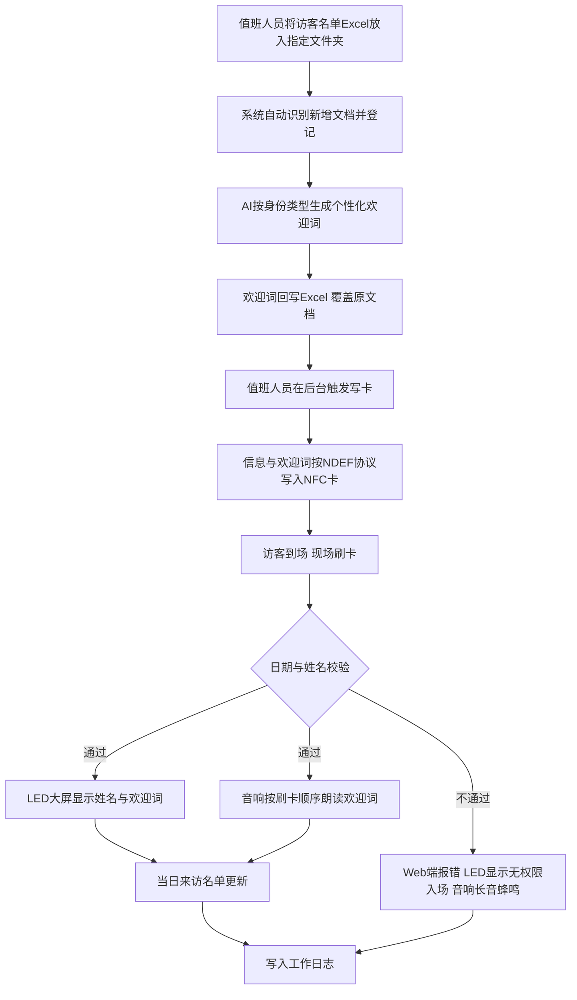

# AITIC 展厅智能前台 · 产品形态与目标规格

> 版本：V1　日期：2026-07-03
> 用途：作为 TARGET.md，供AI编码Agent与协作者理解系统建成后应有的完整目标状态

> **给Agent/协作者的说明**：本文档描述的是系统建成后应有的完整产品形态与行为规则，是判断"实现是否符合需求"的依据；不涉及开发顺序、时间安排、数据表字段类型、代码结构，这些请参考同目录下的《完整实现计划》。文中标注【MVP默认】的条目，是对原始需求中"待明确"项做出的补充判断，不是访谈确认过的硬性需求，如需调整以谭天成后续确认为准。

---

## 一、产品概述

展厅每天接待身份各异的访客——企业领导、合作院校师生、政府考察团、媒体等。系统要替换的是"纸质登记+工作人员手写欢迎词+手举提示牌"这套流程，目标是让访客从踏入展厅门口到被欢迎，全程自动、有仪式感，同时把访客信息沉淀下来供后续查阅统计。

系统运行在展厅前台的一台Windows PC上，本地部署。现场核心动作（刷卡→校验→显示→播报）无需持续联网即可完成（细节见六.1）。系统由四个功能模块串联：**信息登记 → 写卡 → 现场欢迎 → 工作日志**，中间通过AI自动生成的个性化欢迎词、NFC卡片、LED屏幕与音响，完成一套科技感强、几乎不需要人工干预的现场体验。

---

## 二、使用角色与体验旅程

### 2.1 三个角色

| 角色 | 位置/设备 | 核心操作 |
|---|---|---|
| 展厅值班人员 | 工位电脑浏览器（Web管理后台） | 上传/确认访客名单、触发写卡、查看当日名单与工作日志、编辑欢迎词模板、查看硬件状态 |
| 访客 | 展厅入口 | 掏卡一刷 → 等待LED大屏显示姓名与欢迎词、音响朗读欢迎词 → 无需其他操作 |
| 运营/项目负责人 | 同一台电脑 | 查看当月来访汇总、按场次筛选、导出Excel |

### 2.2 完整体验旅程

---

## 三、功能规格

### 3.1 信息登记模块

**输入**：外部访客信息Excel，表头字段固定为：来访日期、计划场次时间、姓名、手机号、国籍、身份证号、性别、单位、身份（企业领导/企业员工/学校老师/大学生/中小学生/政府官员，6选1）。

**自动识别**：系统按固定频率/每次启动时扫描指定文件夹，将相较已登记文档而言"新增"的Excel识别为待登记文档。

**导入流程（两阶段提交）**：
1. 预解析：校验表头字段、必填项、身份枚举合法性，有错误在前端标红，不直接入库
2. 确认入库：值班人员逐行确认（可编辑修正）后提交入库；自动识别与手动上传共用同一套解析逻辑，不允许出现两份规则不一致的parser

**月度汇总总表**：
- 「场次」定义为 (来访日期, 计划场次时间) 的唯一组合，汇总总表按场次分组展示【MVP默认】
- 「自然月」按**来访日期**（不是导入/登记时间）归属，不做跨月拆分【MVP默认】
- 汇总总表为单Sheet，覆盖式更新（每次生成即替换旧版本），支持导出

**AI欢迎词生成**：
- 调用千问，输入访客身份信息，输出与该访客身份类型匹配的个性化欢迎词
- 用户与姓名须严格一一对应，不允许张冠李戴
- AI调用失败时，自动降级为规则模板（模板内容见3.3），保证欢迎词一定能生成，不出现空值
- 生成后写回并覆盖原始的"外部文档-来访用户信息列表"（即"覆盖原有文档"这份输出物）

### 3.2 写卡模块

- 将"用户信息"及对应身份类型的欢迎词，按NDEF协议写入指定NFC卡
- 卡片写入内容至少包含：访客标识、姓名、来访日期、身份类型、欢迎词文本——现场校验环节需要用日期+姓名比对，卡上必须带这两项
- 支持单张/批量触发写卡
- 每次写卡结果（成功/失败）需要可查

### 3.3 现场欢迎模块

- NFC读写器可同时从多张卡接收信息；多卡并发时，按"读到卡的顺序"进入FIFO队列串行处理，保证后续语音播报不重叠、顺序与刷卡顺序一致
- 校验规则：卡片携带的"日期+姓名"与权威访客数据比对，一致即通过（Y），不一致即拒绝（N）
- 校验通过：
  - LED屏幕显示访客姓名与欢迎词，多块LED屏幕通过"一机控多台"的交换机**同步显示同一批次内容**【MVP默认：不做分组分流】
  - 音响按刷卡顺序朗读欢迎词，播放本身不依赖网络（见六.1）
  - 当日来访名单同步更新
- 校验不通过：
  - Web前端（现场实时看板）显示报错信息
  - 对应LED屏幕显示"无权限入场"字样
  - 播放长音蜂鸣警告音——**复用现场播报的同一音响输出通道**实现，不需要额外蜂鸣器硬件（硬件清单中未列出独立蜂鸣器）
- 欢迎词模板（按身份类型，可在管理后台自由编辑）：

| 身份类型 | 默认模板文案 |
|---|---|
| 默认 | 「姓名」先生/女士，欢迎您 |
| 企业领导 | 「姓名」先生/女士，欢迎您 |
| 企业员工 | 「姓名」先生/女士，欢迎您 |
| 政府官员 | 欢迎「姓名」同志到场视察 |
| 学校老师 | 欢迎「姓名」专家到场指导 |
| 大学生 | 「姓名」同学，欢迎参观 |
| 中小学生 | 「姓名」同学，你好呀 |

> 企业领导与企业员工初始文案相同，各自独立一行以便后续单独修改【MVP默认】。"学校老师"映射自原始需求中的"院校老师领导来访"，视为同一类；如两者需要拆成独立身份/模板，需另行确认。

> 💡 原始需求中提到LED屏幕内容"按NDEF协议写入"——NDEF是NFC卡的数据编码标准，LED屏幕本身通常通过厂商自有SDK/协议接收内容。这里应理解为LED显示的是与NFC卡中相同的姓名与欢迎词信息，而非LED设备本身实现NDEF协议，实现时不需要在LED这一环重新套用NDEF。

### 3.4 工作日志模块

- 记录范围覆盖以上三个模块的每一次任务执行/报错：登记、AI生成、写卡、校验、LED、语音、系统级事件（如适配器离线）
- Web前端可按模块/时间/状态筛选查看和下载

---

## 四、数据模型

| 表 | 用途 |
|---|---|
| `visits` | 来访记录，唯一权威数据源 |
| `welcome_templates` | 欢迎词模板，7条（6类身份+默认） |
| `nfc_write_log` | 写卡记录 |
| `verify_log` | 现场校验记录 |
| `work_log` | 工作日志 |
| `adapter_status` | 四个适配器（NFC/LED/TTS/AI）在线状态 |

`visits`核心字段：来访日期、计划场次时间、姓名、手机号、国籍、身份证号（敏感，需脱敏展示）、性别、单位、身份类型、欢迎词文本、欢迎词来源（AI生成/规则兜底）、录入来源（自动/手动）、导入批次号、状态机（待处理→欢迎词已生成→已写卡→已校验/已拒绝）。

完整字段类型定义、事件总线设计、Adapter接口签名、REST API清单见《完整实现计划》（AITIC展厅\_智能前台\_完整实现计划\_V1.md）第四节——那份文档负责"怎么建表、怎么写代码"，这里只需要知道有这6张表、各自存什么。

---

## 五、系统架构约束

- 单机部署：一台Windows PC，本地Python服务+Web前端，不使用Docker/云服务
- 四层架构：表现层（Web） / 业务服务层（登记·AI文案·写卡校验·日志） / 集成适配层（NFC·LED·语音·AI各自的Adapter） / 数据事件层（SQLite+内部事件总线+Excel进出接口）
- SQLite是唯一权威数据源，Excel只做进出接口，不参与内部读写竞争
- NFC/LED/语音/AI四类外部依赖全部通过统一Adapter接口封装，业务逻辑不直接调用具体硬件SDK——开发阶段先用Mock完整验证业务逻辑，硬件到位后只替换Adapter实现，业务代码不变
- 内部通过事件驱动解耦各模块，任一模块故障不应拖垮全局

---

## 六、非功能需求

**6.1 网络策略（两阶段，不是全程离线）**
- 现场刷卡→校验→LED显示→语音播报这一段，必须在无网络环境下可用（原始需求"本地部署、无需联网"specifically针对这一段）
- AI欢迎词生成发生在更早的登记阶段，可以联网调用千问云端API，与上面的离线要求不冲突——只要这一步在访客到场前已完成即可
- 语音播报使用本地离线TTS引擎朗读已生成好的文字，本身不依赖联网合成

**6.2 数据安全**
- 身份证号等敏感字段：前端列表/日志默认脱敏展示，不在日志中明文输出

**6.3 可靠性**
- SQLite需要每日定时备份
- 四个Adapter需上报心跳，管理后台/看板要能直接看到在线状态（红/绿指示），硬件层任何失败都需要用告警横幅"顶出来"，不能只安静记日志

**6.4 可追溯性**
- 每一次登记、AI生成、写卡、校验动作都必须落工作日志，出问题能查到具体是哪一步、什么原因

---

## 七、明确不做的事（V1不做，不要在这些点上额外花时间）

- 不做登录/多用户/权限体系，单一本地管理员使用
- 不做防重放/防重入校验（同一张卡多次刷，只要日期+姓名对得上就一直算通过）
- 不做LED多屏分组分流显示，所有屏幕显示同一批次内容
- 不做Docker/云端部署，不引入PostgreSQL/Redis等额外中间件
- 不做移动端/小程序，只有Web管理后台+现场大屏两种界面形态

---

## 八、验收标准（产品维度的Definition of Done）

- [ ] 新增Excel被自动识别并完成登记，字段与原始需求表头一致
- [ ] 每位访客根据身份类型生成对应的个性化欢迎词，用户与姓名严格一一对应
- [ ] 欢迎词成功回写并覆盖原始访客信息文档
- [ ] 访客信息与欢迎词按NDEF协议成功写入NFC卡
- [ ] 现场多卡并发刷卡时，校验与播报严格按刷卡顺序处理，互不重叠
- [ ] 校验通过：LED显示正确、音响朗读正确、当日名单同步更新
- [ ] 校验不通过：Web报错、LED显示"无权限入场"、音响长音蜂鸣，三者同步触发
- [ ] 月度汇总总表按场次正确分组，可导出
- [ ] 欢迎词模板可在管理后台自由编辑，无需改代码
- [ ] 全流程每一步都有工作日志可查询
- [ ] 断网状态下，从刷卡到语音播报的现场链路可以正常工作
- [ ] 任一硬件Adapter离线时，管理后台/看板有明显红色告警提示

---

## 九、术语表

| 术语 | 含义 |
|---|---|
| 场次 | (来访日期, 计划场次时间) 的唯一组合，是汇总总表的分组维度 |
| 汇总总表 | 按自然月+场次聚合的来访人员总览Excel，覆盖式更新导出，是访客数据的展示视图，不是权威数据源 |
| 覆盖原有文档 | AI生成欢迎词后写回、覆盖原始"外部文档-来访用户信息列表"得到的产物 |
| NDEF | NFC Data Exchange Format，NFC卡片的数据编码协议 |
| 现场校验 | 刷卡时比对卡片"日期+姓名"与权威数据是否一致的动作 |
| 当日来访名单 | 校验通过后实时更新的当天已到场访客列表 |
| Adapter | 封装NFC/LED/语音/AI具体调用细节的统一接口层，有Mock和Real两种实现 |

---

## 十、关联文档

本文档描述"目标产品长什么样、该怎么运作"，是Agent判断实现是否正确的依据。另有三份关联文档：

- 《访客欢迎系统 Brief V1》——最初的原始需求
- 《技术方案 V1》——四层架构与技术选型
- 《完整实现计划》（AITIC展厅\_智能前台\_完整实现计划\_V1.md）——5天冲刺的逐日任务、数据表字段类型、事件总线设计、Adapter接口签名、REST API清单，负责回答"具体怎么写、什么时候写"

本文档中标注【MVP默认】的规则，是基于以上三份文档中"待明确"项做出的补充判断，不是访谈确认的硬性需求，如有变化以谭天成后续确认为准。
